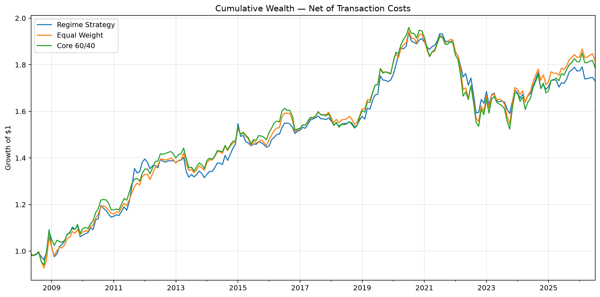
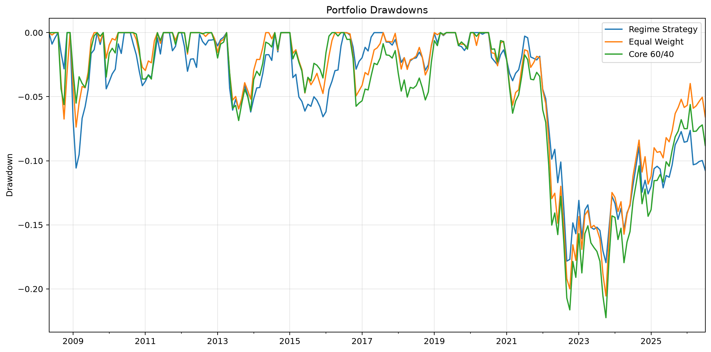
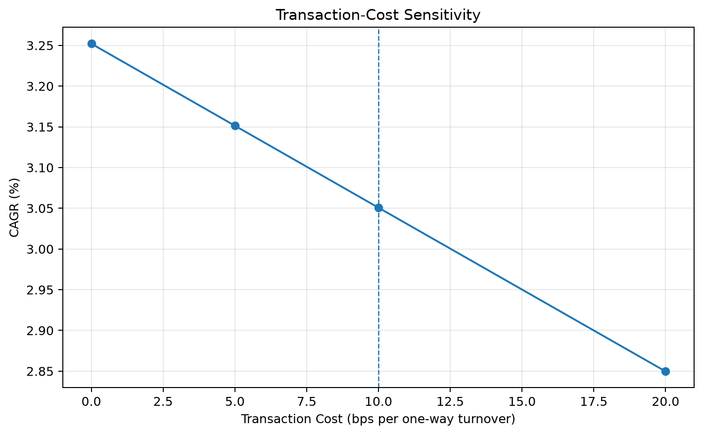

# Global Fixed Income Strategy & Portfolio Research

**U.S. Treasury Rates, Credit Regimes, Portfolio Risk and Performance Attribution**

A systematic fixed-income research project examining whether observable Treasury-rate and corporate-credit conditions can be used to adjust duration and credit exposure in a bond portfolio.

The project follows the research workflow from market-data construction and pre-specified regime definition to portfolio design, transaction-cost-aware backtesting, duration/DV01 analysis, stress testing, performance attribution, and implementation robustness.

---

## Research Question

**Can observable rate and credit-spread regimes be used to adjust duration and credit exposure in a fixed-income portfolio, and does such positioning improve downside risk and risk-adjusted performance relative to static bond allocations?**

The objective was not to search for the highest-returning backtest.

Instead, the project tested whether a simple and economically interpretable fixed-income allocation framework could improve portfolio behavior, particularly during stressed market environments.

---

## Research Design

### Market Indicators

**U.S. Treasury Rates**
- 2-Year
- 5-Year
- 10-Year
- 30-Year

**Yield-Curve Measures**
- 2s10s
- 5s30s

**Credit**
- Moody's Baa corporate spread relative to the 10-Year Treasury

### Investable Universe

| ETF | Role |
|---|---|
| SHY | Short-duration U.S. Treasury |
| IEF | Intermediate-duration U.S. Treasury |
| TLT | Long-duration U.S. Treasury |
| LQD | Investment-grade corporate credit |
| HYG | High-yield corporate credit |

### Sample

- Daily market data: January 2008 – July 2026
- Portfolio decisions: Monthly
- First executable strategy month: May 2008
- Backtest observations: 219 months

---

## Pre-Specified Market Regimes

The strategy uses two simple three-month signals.

### Rate Signal

Three-month change in the U.S. 10-Year Treasury yield:

- **Falling:** 3M yield change < 0
- **Rising:** 3M yield change > 0

### Credit Signal

Three-month change in the Baa corporate credit spread:

- **Tightening:** 3M spread change < 0
- **Widening:** 3M spread change > 0

These signals generate four primary regimes:

1. Falling Rates / Tightening Credit
2. Falling Rates / Widening Credit
3. Rising Rates / Tightening Credit
4. Rising Rates / Widening Credit

Exact zero-change observations are treated as **Stable / Mixed** rather than being forced into a directional regime.

The signal horizon and regime definitions were fixed before portfolio performance was evaluated.

---

## Portfolio Design

The strategy separates two economic decisions:

**Rate regime → Duration exposure**

**Credit regime → Corporate-credit exposure**

| Regime | SHY | IEF | TLT | LQD | HYG |
|---|---:|---:|---:|---:|---:|
| Falling / Tightening | 10% | 15% | 25% | 30% | 20% |
| Falling / Widening | 10% | 30% | 40% | 20% | 0% |
| Rising / Tightening | 35% | 15% | 0% | 30% | 20% |
| Rising / Widening | 55% | 25% | 0% | 20% | 0% |
| Stable / Mixed | 20% | 20% | 20% | 20% | 20% |

Falling-rate regimes increase long-duration Treasury exposure.

Rising-rate regimes shift toward short-duration Treasuries.

Tightening-credit regimes maintain greater corporate-credit exposure, while widening regimes reduce credit exposure and eliminate high-yield exposure.

No portfolio weight was selected using subsequent ETF performance.

---

## Backtest Methodology

Portfolio positions are determined using information available at the previous month-end.

**Month-end regime at t → Portfolio during month t+1**

The backtest therefore avoids using contemporaneous monthly returns to determine portfolio weights.

Turnover is calculated against drifted pre-trade portfolio weights rather than simply comparing consecutive target weights.

The primary implementation assumption is:

**10 bps transaction cost per one-way turnover**

The initial portfolio allocation is treated as initialization and is not charged transaction cost.

### Static Benchmarks

**Equal Weight**
- 20% each in SHY, IEF, TLT, LQD, HYG

**Core 60/40**
- 60% IEF
- 40% LQD

All portfolios are evaluated over the same period and under the same monthly-rebalancing and transaction-cost framework.

---

## Main Results

| Metric | Regime Strategy | Equal Weight | Core 60/40 |
|---|---:|---:|---:|
| Total Return | 73.05% | 81.68% | 78.72% |
| CAGR | 3.05% | 3.33% | 3.23% |
| Annualized Volatility | 6.58% | 6.41% | 6.70% |
| Sharpe (rf = 0) | 0.49 | 0.54 | 0.51 |
| Maximum Drawdown | **-17.95%** | -20.55% | -22.25% |
| Calmar Ratio | **0.17** | 0.16 | 0.15 |
| Annualized Turnover | 195.61% | 7.41% | 3.39% |

### Main Finding

The simple rate-credit regime strategy **did not improve long-run Sharpe or CAGR relative to the static bond allocations**.

Its main observed benefit was instead **downside-risk reduction**.

Maximum drawdown improved from:

- Equal Weight: -20.55%
- Core 60/40: -22.25%

to:

- Regime Strategy: **-17.95%**

The result is therefore better interpreted as a conditional risk-management effect than as evidence of persistent excess return.

---

## Cumulative Performance



The static portfolios finished with higher cumulative wealth.

The regime strategy did not generate persistent long-run outperformance.

---

## Drawdown Analysis



The regime strategy experienced a smaller full-sample maximum drawdown than both static benchmarks, although the protection was not uniform across every stress episode.

---

## Stress-Period Results

| Period | Portfolio | Cumulative Return | Maximum Drawdown |
|---|---|---:|---:|
| Global Financial Crisis | Regime Strategy | 4.28% | -10.57% |
|  | Equal Weight | 2.69% | -7.37% |
|  | Core 60/40 | 4.62% | -5.62% |
| COVID Shock | Regime Strategy | **6.30%** | **-0.12%** |
|  | Equal Weight | 4.16% | -1.00% |
|  | Core 60/40 | 5.28% | -0.29% |
| 2022 Rate Shock | Regime Strategy | **-14.11%** | **-14.04%** |
|  | Equal Weight | -16.14% | -16.24% |
|  | Core 60/40 | -16.24% | -16.61% |

The framework provided meaningful protection during the COVID shock and the 2022 rate-hiking period.

However, it did not improve drawdown during the Global Financial Crisis.

This illustrates that a simple rate-credit regime framework is not a universal hedge against fixed-income stress.

---

## Duration, DV01 and Scenario Risk

ETF-level effective-duration characteristics are aggregated using portfolio weights to estimate portfolio interest-rate sensitivity.

For a $1 million portfolio:

| Regime | Effective Duration | Rate DV01 | Spread-Duration Proxy |
|---|---:|---:|---:|
| Falling / Tightening | 7.85 | $785.1/bp | 2.91 |
| Falling / Widening | 9.75 | $975.2/bp | 1.55 |
| Rising / Tightening | 4.56 | $455.8/bp | 2.91 |
| Rising / Widening | 4.23 | $423.2/bp | 1.55 |

The design therefore meaningfully changes portfolio rate sensitivity across regimes.

For example, the rate DV01 of the Falling / Widening portfolio is more than twice that of the Rising / Widening portfolio.

### Scenario Sensitivity

| Regime | Rates +50bp | Rates +100bp | Credit +100bp | Credit +300bp |
|---|---:|---:|---:|---:|
| Falling / Tightening | -3.93% | -7.85% | -2.91% | -8.74% |
| Falling / Widening | -4.88% | -9.75% | -1.55% | -4.64% |
| Rising / Tightening | -2.28% | -4.56% | -2.91% | -8.74% |
| Rising / Widening | -2.12% | -4.23% | -1.55% | -4.64% |

Credit stress uses effective duration as a first-order spread-duration proxy and should therefore be interpreted as a sensitivity estimate rather than exact bond-level repricing.

---

## Performance Attribution Proxy

Historical security-level duration and spread-duration series are not available in the public dataset.

The attribution is therefore intentionally approximate:

**Realized Gross Return = Rate Contribution Proxy + Credit Contribution Proxy + Residual**

Transaction costs are then deducted separately.

The residual includes effects not captured by the simplified rate and credit proxies, including:

- carry
- roll-down
- convexity
- changing historical duration
- spread-basis differences
- ETF tracking
- other pricing effects

### Annualized Arithmetic Contribution

| Component | Contribution |
|---|---:|
| Rate Contribution Proxy | -0.32% |
| Credit Contribution Proxy | +0.33% |
| Residual | +3.41% |
| Transaction Cost | -0.20% |
| Actual Net Arithmetic Return | 3.22% |

The rate and credit proxies approximately offset each other over the full sample.

Most long-run return therefore cannot be attributed to the simplified directional rate and credit signals alone.

This is an important limitation of the attribution framework rather than evidence of unexplained alpha.

---

## Why Turnover Was High

The strategy generated approximately **196% annualized turnover**.

The main reason was frequent regime switching:

- Regime switches: 105
- Total backtest months: 219
- Monthly regime-switch frequency: 47.95%

Average monthly turnover was approximately:

- No regime change: 0.51%
- Regime change: 33.44%

Thus, implementation drag was driven primarily by discrete regime changes rather than ordinary portfolio drift.

---

## Transaction-Cost Robustness

The signal definitions, regime definitions, and portfolio weights were held constant.

Only the transaction-cost assumption was changed.

| Cost | CAGR | Sharpe | Maximum Drawdown |
|---|---:|---:|---:|
| 0 bps | 3.25% | 0.52 | -17.55% |
| 5 bps | 3.15% | 0.51 | -17.73% |
| **10 bps** | **3.05%** | **0.49** | **-17.95%** |
| 20 bps | 2.85% | 0.46 | -18.39% |



Higher transaction costs predictably reduce performance.

However, even with zero transaction costs, the strategy's Sharpe ratio remains below the Equal Weight benchmark.

Therefore, implementation cost is a meaningful drag but does not fully explain the strategy's long-run underperformance.

---

## Current Model View

As of the July 2026 month-end signal:

**Regime: Rising Rates / Tightening Credit**

Model allocation:

| ETF | Weight |
|---|---:|
| SHY | 35% |
| IEF | 15% |
| TLT | 0% |
| LQD | 30% |
| HYG | 20% |

The model therefore favors shorter duration while retaining corporate-credit exposure.

A separate one-page research view is available here:

[U.S. Fixed Income View](reports/fixed_income_view.md)

---

## Key Findings

1. **Simple rate-credit regime positioning did not improve long-run Sharpe.**
2. **The strategy reduced full-sample maximum drawdown relative to both static benchmarks.**
3. **Downside protection was regime-dependent rather than universal.**
4. **Duration positioning was useful in selected rate-shock environments.**
5. **Frequent regime switching generated substantial turnover and implementation drag.**
6. **Removing transaction costs alone was insufficient to make the strategy outperform on Sharpe.**
7. **Most long-run return was not explained by the simplified rate and credit attribution proxies.**

---

## Limitations

This project deliberately uses a simple and reproducible framework, which creates several limitations.

- ETF-adjusted prices are used as practical total-return proxies rather than institutional bond-index returns.
- Baa corporate spread is used as a long-history credit proxy and does not exactly match LQD or HYG option-adjusted spreads.
- Historical ETF-level duration and spread-duration time series are unavailable in the public dataset.
- Current effective duration is therefore used only as a reference characteristic for risk and attribution analysis.
- Credit scenario analysis uses effective duration as a spread-duration proxy.
- The strategy uses coarse regime thresholds and discrete portfolio weights.
- Frequent regime switching leads to high turnover.
- Sharpe uses a zero risk-free-rate convention.
- No tax, bid-ask asymmetry, market impact, or fund-level execution constraints are modeled.

These limitations are documented rather than corrected after observing the backtest.

---

## Repository Structure

```text
global-fixed-income-strategy/
│
├── notebooks/
│   ├── 01_data_pipeline.ipynb
│   ├── 02_regime_analysis.ipynb
│   ├── 03_portfolio_design.ipynb
│   ├── 04_backtest.ipynb
│   ├── 05_risk_scenarios.ipynb
│   ├── 06_performance_attribution.ipynb
│   └── 07_implementation_robustness.ipynb
│
├── figures/
│   ├── cumulative_wealth.png
│   ├── drawdowns.png
│   └── transaction_cost_sensitivity.png
│
├── reports/
│   └── fixed_income_view.md
│
├── README.md
├── requirements.txt
└── .gitignore